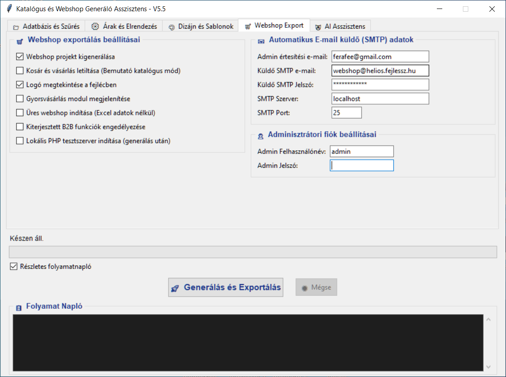
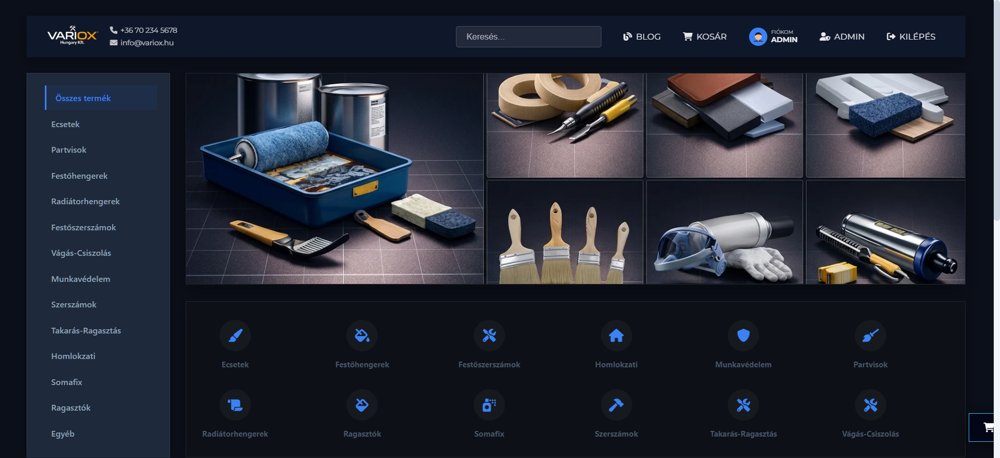
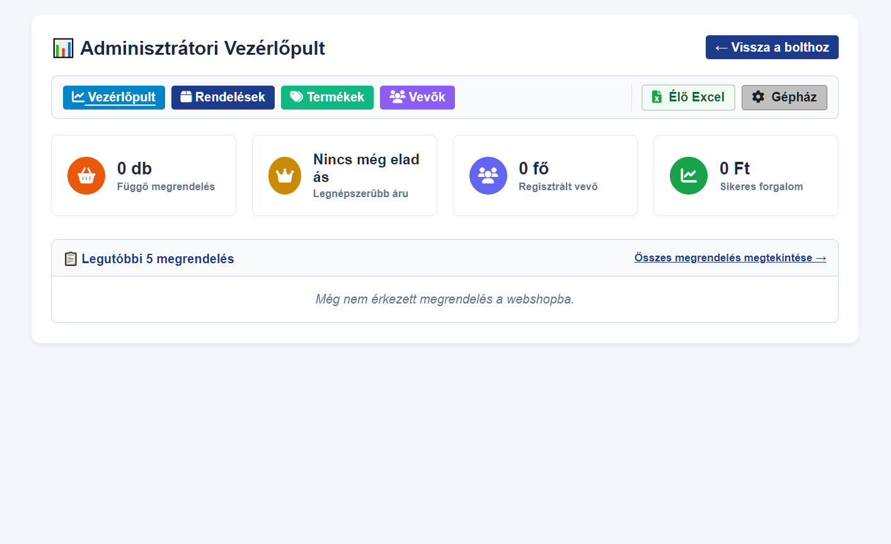
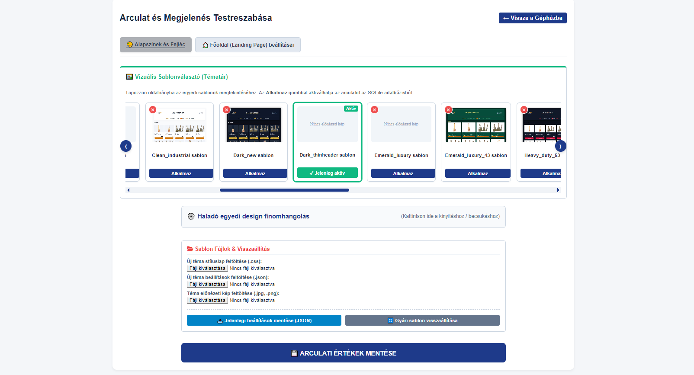
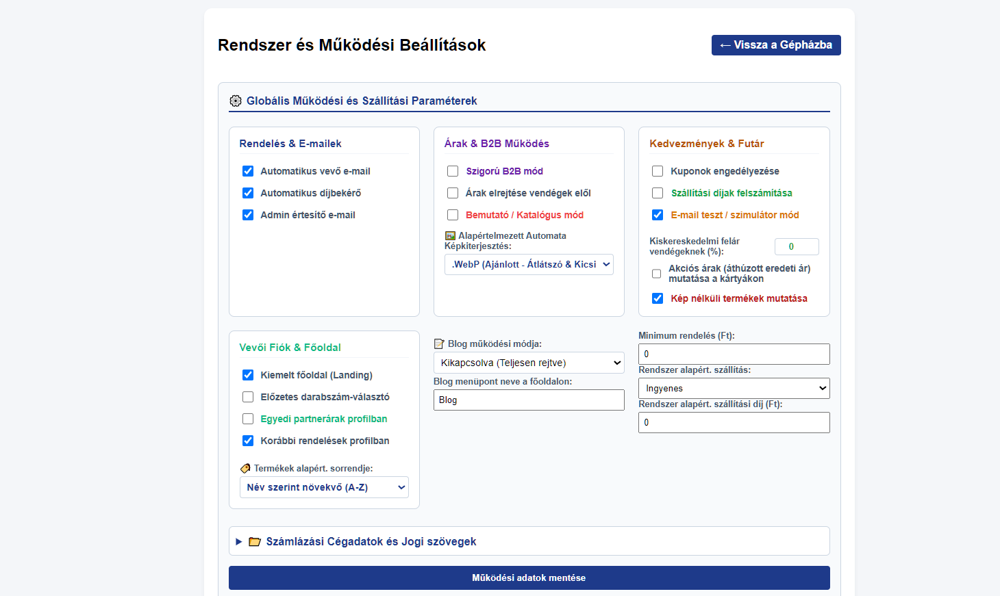

# 🚀 Python ➡️ PHP Webshop & Brochure Generator

[](https://www.python.org/)
[](https://www.php.net/)
[](https://onnxruntime.ai/)
[](https://weasyprint.org/)
[](http://edger.nhely.hu/)

> **Hybrid e-commerce compilation and publishing engine.**
> Compiles a zero-dependency, ultra-fast **PHP 8.x e-commerce storefront** (powered by SQLite, B2B wholesale features, and an in-browser AI photo studio) alongside print-ready **A4 digital PDF product brochures** directly from a unified desktop Python core.

---

## 🌐 Live Production Demo
An operational storefront generated by this system is running live and can be explored at:
👉 **[http://edger.nhely.hu/](http://edger.nhely.hu/)**
👉 **Live Catalog:** [http://lui.fejlessz.hu/](http://lui.fejlessz.hu/)

*(Features real-time fuzzy search with synonym expansion, B2B tiered pricing, interactive mini-cart, and dynamic theme switching.)*

---

## 💡 Engineering Motivation & Architecture

Monolithic content management systems (WooCommerce, Magento) incur substantial database overhead, plugin vulnerabilities, and severe server latency.
This solution replaces runtime CMS bloat with a compile-time workflow:
1. **Compile-Time Generation:** Raw inventory spreadsheets and media files are ingested by Python, automatically generating modular PHP controllers, views, and a pre-indexed SQLite database.
2. **Dual-Channel Output:** Compiles an interactive digital webshop AND an A4 printable PDF catalogue (WeasyPrint) from a single SKU data source.
3. **Zero External Runtime Overhead:** The generated webshop runs standalone with zero PHP framework overhead or MySQL requirements.
4. **Embedded PHP Server:** Integrated development server launcher (`php -S 127.0.0.1:8000`) directly from the Python GUI.

---

## 🏗️ System Architecture

```text
┌─────────────────────────────────────────────────────────────────────────────┐
│                 PYTHON ORCHESTRATION & COMPILATION CORE (GUI & ENGINE)       │
├──────────────────────┬───────────────────────┬──────────────────────────────┤
│  Excel & SKU Parser  │ Pillow & WebP         │ WeasyPrint & PDF             │
│  (openpyxl pipeline) │ Image Optimization    │ Brochure Generator           │
└──────────┬───────────┴───────────┬───────────┴──────────────┬───────────────┘
           │                       │                          │
           ▼                       ▼                          ▼
┌─────────────────────────────────────────────────────────────────────────────┐
│                     COMPILED STANDALONE PHP 8.X WEBSHOP                     │
├───────────────────────────────┬─────────────────────────────────────────────┤
│ 🛒 STOREFRONT RUNTIME         │ ⚙️ ADMIN CONTROL ROOM ("GÉPHÁZ")             │
│ • index.php (Storefront grid) │ • admin.php (Analytics dashboard & metrics) │
│ • product.php (SEO details)   │ • admin_products.php (Catalog management)   │
│ • cart.php (B2B deferred pay) │ • admin_orders.php (Order workflow & proforma│
│ • blog.php (Rich text mag)    │ • admin_users.php (Wholesale, VIES, credit) │
├───────────────────────────────┴─────────────────────────────────────────────┤
│ 🤖 ADVANCED SUBSYSTEMS:                                                     │
│ • AI Photo Studio: Client-side ONNX Runtime Web (ISNet model offline)       │
│ • In-Browser Live Excel Grid: Real-time SheetJS editor & markup calculator  │
│ • AI-Bridge Theme Customizer: ChatGPT JSON/CSS synchronizer with undo snapshots│
│ • Fuzzy Search Engine: Synonym lexicon expansion with typo-tolerant scoring │
└─────────────────────────────────────────────────────────────────────────────┘
```

---

## ✨ Key Engineering Highlights

### 1. 🤖 Client-Side In-Browser AI Photo Studio (`admin_image_editor.php`)
- **Offline Edge AI:** Leverages **ONNX Runtime Web** (`isnet_fp16/model.onnx`) to perform automated background removal directly in the browser via WASM/SIMD without server GPU costs or external API calls.
- **Specialized Product Studio Tools:**
  - *Solidify AI:* Prevents artificial transparency on glossy metal and tool reflections.
  - *Alpha Cutoff & White Purge:* Strips residual halo artifacts from studio backgrounds.
  - *Geometric Manipulation:* 45° tool diagonal rotation, 3D studio shadows, edge glow auras, and perspective reflections.
  - *Watermarking:* Burn-in watermarking with configurable opacity and scale.

### 2. 👥 Enterprise B2B Wholesale Engine (`admin_users.php`, `cart.php`)
- Per-customer individual SKU pricing agreements (`user_custom_prices` table).
- Deferred invoice payments with automated credit limit validation and payment terms (8/15/30 days).
- Real-time VIES EU VAT validation through European Commission REST API.
- Bulk quick-order text input parsing for industrial buyers.

### 3. 📊 In-Browser Live Excel Grid Editor (`admin_grid_editor.php`)
- Bi-directional synchronization between SQLite and browser grid.
- Real-time gross margin and markup calculations.
- Bulk XLSX import/export with automated image asset matching.

### 4. 🔍 Intelligent Search Engine with Synonym Lexicon (`catalog_script.js`)
- Accent-insensitive Hungarian text normalization (`removeAccents`).
- Multi-tier relevance scoring (SKU exact: 150 > SKU substring: 100 > Title: 80 > Specs: 25).
- Expandable synonym dictionary (`synonyms.json`) for fuzzy discoverability.

### 5. 📄 High-Density Print Catalog Pipeline (`engine.py`)
- Automated image aspect-ratio cropping (`autocrop_image`) eliminating vendor whitespace.
- Space-saving multi-column responsive printing templates.
- Automated WebP compression and quality tuning.

---

## 🔒 Curated Architecture Showcase Notice (Strategy #1)

> **Notice for Technical Reviewers & Hiring Teams:**
> This public repository contains the **architectural demonstration**, core interfaces, and sanitized mock pipelines.
> Production enterprise templates, private client database configurations, and proprietary commercial prompts are maintained in a private repository in compliance with intellectual property standards.
> 
> The functional live deployment can be verified on the production server: **[http://edger.nhely.hu/](http://edger.nhely.hu/)**

---
## System Screenshots

### 1. Desktop Configuration & Generator Utility (Python)
*Desktop tool for automated catalog and webshop generation, featuring automated export workflows, SMTP mailer configuration, and one-click local PHP test server execution:*



### 2. Generated E-Commerce Storefront & Admin Dashboard (PHP / MySQL / JS)
*Overview of the generated responsive e-commerce storefront and its comprehensive backend administration suite:*










## 🛠️ Technology Stack

| Layer | Technology | Responsibilities |
|---|---|---|
| **Desktop Orchestrator** | Python 3.10+, Tkinter / ttk | Control GUI, build lifecycle, process logging |
| **Brochure Compiler** | WeasyPrint, Pillow, openpyxl | PDF rendering, catalog compilation, image pipeline |
| **Webshop Backend** | PHP 8.x (Zero-framework), PDO SQLite | High-speed standalone storefront, audit transaction logs |
| **In-Browser AI** | ONNX Runtime Web, ISNet Vision Model | Offline, client-side neural background extraction |
| **Data Storage** | SQLite 3 | Embedded zero-configuration relational database with indexing |
| **Frontend Runtime** | Vanilla JavaScript, Modern CSS3 | Ultra-responsive desktop/mobile UI without framework bloat |

---

## 🚀 Running the Local Architectural Demo

1. **Clone the repository:**
   ```bash
   git clone https://github.com/felhasznaloneved/webshop-generator-demo.git
   cd webshop-generator-demo
   ```

2. **Setup virtual environment:**
   ```bash
   python -m venv venv
   source venv/bin/activate  # Windows: venv\Scripts\activate
   pip install -r requirements.txt
   ```

3. **Execute compilation:**
   ```bash
   python demo_generator.py --config config.example.json
   ```

4. **Launch embedded web server:**
   ```bash
   python demo_generator.py --serve
   # Visit: http://localhost:8000
   ```

---

## 👤 Author & Contact
- **Author:** Mészáros Ferenc (Mérnök-Informatikus)
- **Email:** [mfera36@gmail.com](mailto:mfera36@gmail.com)
- **GitHub:** [@ferenc-dev72](https://github.com/ferenc-dev72)
- **Live Webshop:** [http://edger.nhely.hu/](http://edger.nhely.hu/)
- **Live Catalog:** [http://lui.fejlessz.hu/](http://lui.fejlessz.hu/)


---

## 🇭🇺 Magyar Nyelvű Projekt Összefoglaló (Hungarian Summary)

### Rendszeráttekintés és Főbb Képességek

[](https://www.python.org/)
[](https://www.php.net/)
[](https://onnxruntime.ai/)
[](https://weasyprint.org/)
[](http://edger.nhely.hu/)

> **Hibrid e-kereskedelmi és kiadványszerkesztési szoftvercsomag.** 
> Egy központi asztali Python motorból automatikusan fordít és generál teljes körű, külső CMS nélküli, ultragyors **PHP 8.x webáruházat** (SQLite adatbázissal, B2B nagykereskedelmi funkciókkal és beépített böngészős AI képszerkesztővel), valamint ugyanabból az adathalmazból **nyomdakész digitális PDF katalógusokat**.

---

## 🌐 Élő Referencia Webshop
A generátor által létrehozott működő, éles referencia webáruház közvetlenül elérhető és tesztelhető:
👉 **[http://edger.nhely.hu/](http://edger.nhely.hu/)**

*(Reszponzív katalógus, szinonimákkal ellátott intelligens kereső, B2B partnerárazás, interaktív mini-kosár és dinamikus arculatváltó.)*

---

## 💡 Miért született meg a projekt?

A hagyományos tartalomkezelő rendszerek (WordPress, WooCommerce, Magento) lassúak, nehezen karbantarthatók, sérülékenyek a bővítmények miatt, és jelentős szerver-erőforrást igényelnek.
Ez a generátor rendszerszinten oldja meg a problémát:
1. **Compile-Time generálás:** A Python motor a strukturált Excel táblázatból és képekből előre felépíti a moduláris PHP kódot és a feltöltött SQLite adatbázist.
2. **Kettős kimenet egyetlen forrásból:** Ugyanabból az Excel termékbázisból párhuzamosan készül a nagy teljesítményű online webshop ÉS a nyomdai minőségű A4-es PDF prospektus (WeasyPrint).
3. **Zéró külső függőség:** A generált webshop futtatásához elegendő egy tiszta PHP szerver SQLite-tal; nincs szükség MySQL szerverre vagy nehézkes frameworkökre.
4. **Beépített fejlesztői PHP szerver:** A Python GUI-ból egyetlen kattintással elindul a beágyazott tesztszerver (`php -S 127.0.0.1:8000`).

---

## 🏗️ Rendszerarchitektúra és Modulok

```text
┌─────────────────────────────────────────────────────────────────────────────┐
│                    PYTHON ASZTALI VEZÉRLŐ KÖZPONT (GUI & ENGINE)            │
├──────────────────────┬───────────────────────┬──────────────────────────────┤
│  Excel & SKU Parser  │ Pillow & WebP         │ WeasyPrint & PDF             │
│  (openpyxl adatbázis)│ Kép-optimalizálás     │ Prospektus Generátor         │
└──────────┬───────────┴───────────┬───────────┴──────────────┬───────────────┘
           │                       │                          │
           ▼                       ▼                          ▼
┌─────────────────────────────────────────────────────────────────────────────┐
│                    GENERÁLT STANDALONE PHP 8.X WEBSHOP                      │
├───────────────────────────────┬─────────────────────────────────────────────┤
│ 🛒 VÁSÁRLÓI FELÜLET           │ ⚙️ ADMINISZTRÁCIÓ & GÉPHÁZ                  │
│ • index.php (Katalógus)       │ • admin.php (Vezérlőpult & Forgalom stat)   │
│ • product.php (SEO adatlap)   │ • admin_products.php (Termékkezelő & B2B)   │
│ • cart.php (Kosár & B2B utalás│ • admin_orders.php (Megrendelések & Számla) │
│ • blog.php (Szakmai magazin)  │ • admin_users.php (Vevők, Hitelkeret, VIES) │
├───────────────────────────────┴─────────────────────────────────────────────┤
│ 🤖 KÜLÖNLEGES TECHNOLÓGIAI ALRENDSZEREK:                                   │
│ • AI Képszerkesztő Stúdió: Kliensoldali ONNX Runtime Web (ISNet modell)     │
│ • Élő Excel Táblázat Szerkesztő: Browser Grid Editor (xlsx.full.min.js)     │
│ • AI-Híd Arculatgenerátor: ChatGPT JSON/CSS szinkronizáció és Undo mentés  │
│ • Intelligens Keresőmotor: Szinonimaszótár (synonyms.json) & fuzzy relevancia│
└─────────────────────────────────────────────────────────────────────────────┘
```

---

## ✨ Főbb Mérnöki Eredmények és Képességek

### 1. 🤖 Beépített Kliensoldali AI Képszerkesztő Stúdió (`admin_image_editor.php`)
- **Helyi mesterséges intelligencia:** A böngészőben futó **ONNX Runtime Web** (`isnet_fp16/model.onnx`) segítségével szerveroldali GPU vagy külső API költség nélkül, offline távolítja el a termékfotók hátterét.
- **Speciális fotós szűrők:**
  - *Solidify AI (Tárgy-test tömörítés):* Kifejezetten polírozott fémekhez, szerszámokhoz és üvegekhez.
  - *Alpha Cutoff & White Purge:* Fehér háttér és fátyol maradéktalan eltávolítása.
  - *Geometriai effektek:* 45°-os szerszám-forgatás, stúdióárnyék, ragyogás-aura és tükröződés.
  - *Vízjel generátor:* Automatikus diszkrét vízjel ráégetése a termékképekre.

### 2. 👥 Haladó B2B Nagykereskedelmi Motor (`admin_users.php`, `cart.php`)
- Vevőspecifikus egyedi árak termékenként (`user_custom_prices` tábla).
- Halasztott banki átutalás hitelkeret- és fizetési határidő (8/15/30 nap) ellenőrzéssel.
- VIES automatikus EU-s adószám-érvényesítés és címkitöltés közvetlenül az Európai Bizottság API-ján keresztül.
- B2B gyorsrendelés szöveges cikkszám-mennyiség beillesztéssel.

### 3. 📊 Élő Excel Táblázat Szerkesztő a Böngészőben (`admin_grid_editor.php`)
- Kétirányú szinkronizáció az SQLite adatbázis és a felületi rács között.
- Valós idejű árrés- és haszonkulcs-számítás a beszerzési és eladási ár alapján.
- Tömeges XLSX import és export (`SheetJS / xlsx.full.min.js`) képek automatikus feloldásával.

### 4. 🔍 Intelligens Keresőmotor és Szinonimaszótár (`catalog_script.js`)
- Magyar ékezetmentesítő normalizálás (`removeAccents`).
- Relevancia-súlyozott találati lista (Cikkszám > Megnevezés > Típus > Leírás).
- Bővíthető szinonima-adatbázis (`synonyms.json`) elgépelés-toleranciával.

### 5. 📄 Nyomdakész Prospektus & PDF Export (`engine.py`)
- Képek automatikus levágása (`autocrop_image`) a felesleges margók eltüntetésére.
- Helytakarékos és ultra-kompakt nyomtatási elrendezések lapozható A4 formátumban.
- WebP képkonverzió és felbontás-optimalizálás.

---

## 🔒 Demó Repository Megjegyzés (1. Stratégia: Építészeti Demó)

> **Megjegyzés a toborzóknak és vezetőknek:**
> Ez a nyilvános repository a szoftverrendszer **architekturális demonstrációját**, tiszta interfészeit és vezérlési mintáit mutatja be.
> A kereskedelmi sablongyűjtemény, az éles adatbázis-állomány és a védett üzleti logikák szellemi tulajdonvédelmi okokból privát kódtárban találhatók.
> 
> A működő végeredmény teljes funkcionalitásában kipróbálható a fenti élő referencián: **[http://edger.nhely.hu/](http://edger.nhely.hu/)**

---

## 🛠️ Technológiai Stack

| Réteg | Technológia | Szerep |
|---|---|---|
| **Asztali Vezérlő** | Python 3.10+, Tkinter / ttk | Fő vezérlőpult, konfigurációkezelés, folyamatnapló |
| **Kiadványszerkesztő** | WeasyPrint, Pillow (PIL), openpyxl | PDF katalógusfordító, Excel adatfeldolgozás, képvágás |
| **Webshop Backend** | PHP 8.x (Vanilla, zero-framework), PDO SQLite | Villámgyors, önálló webáruház motor tranzakciós naplózással |
| **Böngészős AI** | ONNX Runtime Web (WASM / SIMD), ISNet | Kliensoldali, offline mesterséges intelligencia képszerkesztés |
| **Adatbázis** | SQLite 3 | Beágyazott, hordozható relációs adatbázis gyorsító indexekkel |
| **Frontend** | Vanilla JS (ES6+), Modern CSS3, FontAwesome | Reszponzív asztali és mobil felület külső nehéz keretrendszerek nélkül |

---

## 🚀 Helyi Futtatás (Demó Mód)

1. **Tároló klónozása:**
   ```bash
   git clone https://github.com/felhasznaloneved/webshop-generator-demo.git
   cd webshop-generator-demo
   ```

2. **Python környezet beállítása:**
   ```bash
   python -m venv venv
   source venv/bin/activate  # Windows: venv\Scripts\activate
   pip install -r requirements.txt
   ```

3. **Demó generátor indítása:**
   ```bash
   python demo_generator.py --config config.example.json
   ```

4. **Webshop tesztelése beépített PHP szerverrel:**
   ```bash
   python demo_generator.py --serve
   # Nyisd meg: http://localhost:8000
   ```

---

## 👤 Készítő & Elérhetőség
- **Készítette:** Mészáros Ferenc (Mérnök-Informatikus / Full-Stack Fejlesztő)
- **Email:** [mfera36@gmail.com](mailto:mfera36@gmail.com)
- **GitHub:** [@ferenc-dev72](https://github.com/ferenc-dev72)
- **Élő Webshop referencia:** [http://edger.nhely.hu/](http://edger.nhely.hu/)
- **Élő katalógus referencia:** [http://lui.fejlessz.hu/](http://lui.fejlessz.hu/)

